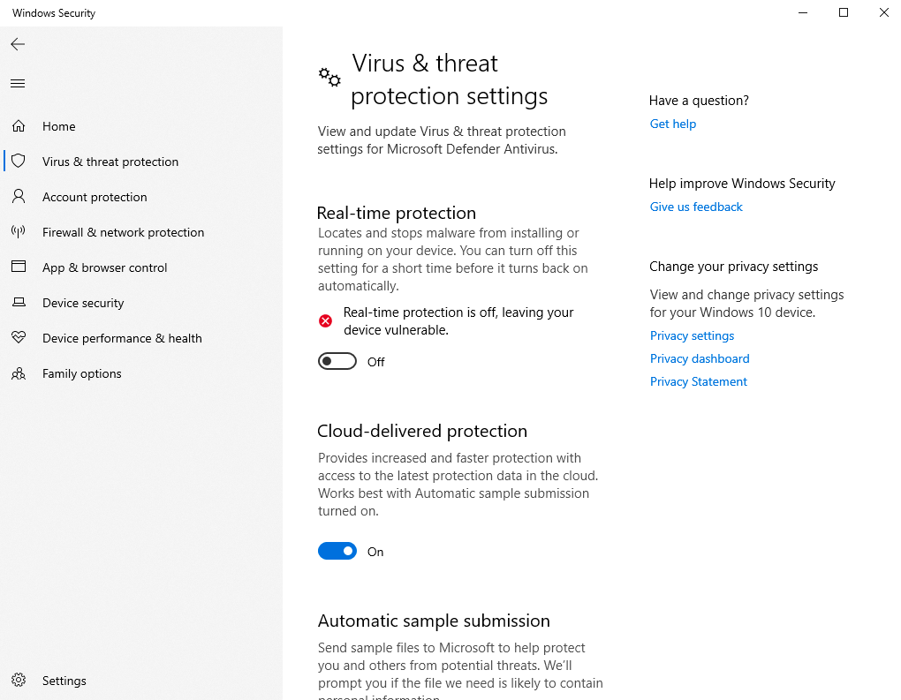

# _Final Project: Cybersecurity Script Kit_

&nbsp; 🔷 &nbsp;
[Week One Contributions](https://github.com/CIS3296SoftwareDesignF21/prj-01-cybersecurity-script-kit/blob/ReadmeV2/markdowns/Week1.md)
&nbsp; 🔷 &nbsp;
[Week Two Contributions](https://github.com/CIS3296SoftwareDesignF21/prj-01-cybersecurity-script-kit/blob/ReadmeV2/markdowns/Week2.md)
&nbsp; 🔷 &nbsp;
[Week Three Contributions](https://github.com/CIS3296SoftwareDesignF21/prj-01-cybersecurity-script-kit/blob/ReadmeV2/markdowns/Week3.md)
&nbsp; 🔷 &nbsp; [Week Four Contributions](https://github.com/CIS3296SoftwareDesignF21/prj-01-cybersecurity-script-kit/blob/ReadmeV2/markdowns/week4.md)

For any cybersecurity professional, scripting is an important part of testing the defense of any network or computer system. This command line tool encompasses the entire Cyber Kill chain developed by Lockheed martin. 

|     | Table of Contents                                     |
| --- | ----------------------------------------------------- |
| 🛠   | [Installation](#installation)                         |
| 🥷   | [Usage](#usage)                                       |
| 👨‍💻  | [Development Instructions](https://github.com/CIS3296SoftwareDesignF21/prj-01-cybersecurity-script-kit/blob/ReadmeV2/markdowns/devInstruc.md) |
| ⬆️  | [Updates and Changes](#updates-and-changes)           |
| 👁   | [Vision](https://github.com/CIS3296SoftwareDesignF21/prj-01-cybersecurity-script-kit/blob/ReadmeV2/markdowns/Personas%2B.md)            |
| 💁  | [The Four Personas](https://github.com/CIS3296SoftwareDesignF21/prj-01-cybersecurity-script-kit/blob/ReadmeV2/markdowns/Personas%2B.md) |
| 📊  | [UML Diagram](https://github.com/CIS3296SoftwareDesignF21/prj-01-cybersecurity-script-kit/blob/ReadmeV2/markdowns/UML.md)               |


## Installation

| [](https://github.com/CIS3296SoftwareDesignF21/prj-01-cybersecurity-script-kit/releases/download/v0.0.3-beta/csk-installer.zsh) | [](installer/csk-installer.bash) | [](installer/csk-installer.bat) |
| ------------------------------------------------------------------------------------------------------------------------------------------------------------------- | ------------------------------------------------------------------- | ---------------------------------------------------------------- |

After downloading, double click the file. Done. 😀 👍

## Usage

Checking version and platform information: `csk -v` or `csk --version`.

Getting help with usage: `csk -h` or `csk --help`.

### Available Commands

> The "Available Commands" are commands which can be accessed via the CLI

Arguments enclosed within `(` parenthesis `)` are optional and will be prompted
for upon execution of the script.

| Commmand           | Arguments                   | Description                                                 |
| ------------------ | --------------------------- | ----------------------------------------------------------- |
| `version`          | none                        | Prints the `csk` shell version                              |
| `exit`             | none                        | Exits the `csk` shell                                       |
| `cd`               | `dir`                       | Changed the shell directory to an absolute or relative path |
| `clone`            | `repo`                      | Pulls a git repository                                      |
| `certifi`          | none                        | Installs the python certificate for `http-headers`          |
| `http-headers`     | `(url)`                     | Retrieves and prints the `http(s)` headers for a given URL  |
| `password-cracker` | none                        | Attempts to crack a password                                |
| `sql-inject`       | none                        | Attempts to manipulate HTML forms for "SQL Injection"       |
| `floodSYN`         | none                        | I don't know                                                |
| `install`          | `-d` or `--deps`, `package` | Installs the dependencies required for a specific script    |
| `keylogger`        | none                        | Keeps track of all keystrokes on the keyboard               |

If another command is provided, then the command is run via the system shell program.


## Development Instructions

When running the program to test if production-ready or to install the program,
the native method is suggested.

**Step 1:** Build `csk` using the `makefile`

```bash
make
```

**Step 2:** Install `csk` using the `makefile` (again).

```bash
make csk
```

**Alternatively, you can copy the executable to a location of your choice**

```bash
cp dist/csk [/path/to/installation/location]
```

**Step 3:** Add `csk` to your `PATH` environment variable.

If you used `make csk` then `/usr/local/bin/` should already be added to
your path. If you manually copied the executable to another location which
is not already in your `PATH` environment variable, then you should add it.

The alternative is to manually type out the path of your executable (**which
is not suggested for ease of use**).

**Step 4:** Run `csk`

```bash
csk [...args]
```

If you installed `csk` to another location, then the command looks like:

```bash
/path/to/csk [...args]      # For absolute path
./path/to/csk [...args]     # For relative path
../path/to/csk [...args]    # For parent-relative path
```

## Common Issues and Resolutions

### Installation is not Working? (All Platforms)

Prior to installation, please:

-   Ensure you have a working Python 3.6+ installation.
-   Ensure `pip` is installed (the Python Package Installer)
-   Ensure `pyinstaller` is installed:
    -   Run `pip3 install pyinstaller`
    -   Run `pip install pyinstaller`, if the previous command does not work

### Windows: PowerShell believes the script kit contains a virus?

If you are on Windows, when working with the PowerShell, you may require elevated privileges.
To escelate your privileges to `admin`, run the command below:

```batch
PS > Start-Process powershell -Verb runAs
```

You may also have to turn off `Real-time Protection` in your Virus & Threat Protection settings.



## Updates and changes

> Instead of hosting on own site, make library directly on github. To test scripts, we will use GitHub CI. We will use the command line to download directly from GitHub.
