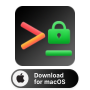
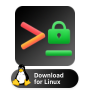
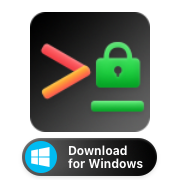

# _Final Project: Cybersecurity Script Kit_

<u>Professor - Dominic Letarte</u>
<u>TA - Noah Williams</u>

|     | Table of Contents                                     |
| --- | ----------------------------------------------------- |
| 🛠   | [Installation](#installation)                         |
| 🥷   | [Usage](#usage)                                       |
| 👨‍💻  | [Development Instructions](#development-instructions) |
| ⬆️  | [Updates and Changes](#updates-and-changes)           |
| 👁   | [Vision](#vision)                                     |
| 💁  | [The Four Personas](#the-four-personas)               |
| 📊  | [UML Diagram](#uml-diagram)                           |

&nbsp; 🔷 &nbsp;
[Week One Markdown](https://github.com/CIS3296SoftwareDesignF21/prj-01-cybersecurity-script-kit/blob/main/Week1.md)
&nbsp; 🔷 &nbsp;
[Week Two Markdown](https://github.com/CIS3296SoftwareDesignF21/prj-01-cybersecurity-script-kit/blob/main/Week2.md)
&nbsp; 🔷 &nbsp;
[Week Three Markdown](https://github.com/CIS3296SoftwareDesignF21/prj-01-cybersecurity-script-kit/blob/main/Week3.md)
&nbsp; 🔷 &nbsp;

For any cybersecurity professional, scripting is an important part of testing the defense of any network or computer system. Being able to have a collection of scripts that will automate any recurring process or having set of security tools is a must for any professional in the field. Not everyone is a coding wizard, being able to have a bunch of scripts at the drop of a hat is not only helpful but convenient. The idea for this project is to create a web site that will host a small library of scrips that would complete various tasks that any beginner or expert security professional would need in the field.

## Installation

| [](https://github.com/CIS3296SoftwareDesignF21/prj-01-cybersecurity-script-kit/releases/download/v0.0.3-beta/csk-installer.zsh) | [](installer/csk-installer.bash) | [](installer/csk-installer.bat) |
| ------------------------------------------------------------------------------------------------------------------------------------------------------------------- | ------------------------------------------------------------------- | ---------------------------------------------------------------- |

After downloading, double click the file. Done. 😀 👍

## Usage

Checking version and platform information: `csk -v` or `csk --version`.

Getting help with usage: `csk -h` or `csk --help`.

### Available Commands

> The "Available Commands" are commands which can be accessed via the CLI

Arguments enclosed within `(` parenthesis `)` are optional and will be prompted
for upon execution of the script.

| Commmand           | Arguments                   | Description                                                 |
| ------------------ | --------------------------- | ----------------------------------------------------------- |
| `version`          | none                        | Prints the `csk` shell version                              |
| `exit`             | none                        | Exits the `csk` shell                                       |
| `cd`               | `dir`                       | Changed the shell directory to an absolute or relative path |
| `clone`            | `repo`                      | Pulls a git repository                                      |
| `certifi`          | none                        | Installs the python certificate for `http-headers`          |
| `http-headers`     | `(url)`                     | Retrieves and prints the `http(s)` headers for a given URL  |
| `password-cracker` | none                        | Attempts to crack a password                                |
| `sql-inject`       | none                        | Attempts to manipulate HTML forms for "SQL Injection"       |
| `floodSYN`         | none                        | I don't know                                                |
| `install`          | `-d` or `--deps`, `package` | Installs the dependencies required for a specific script    |
| `keylogger`        | none                        | Keeps track of all keystrokes on the keyboard               |

If another command is provided, then the command is run via the system shell program.

## Development Instructions

When running the program to test if production-ready or to install the program,
the native method is suggested.

**Step 1:** Build `csk` using the `makefile`

```bash
make
```

**Step 2:** Install `csk` using the `makefile` (again).

```bash
make csk
```

**Alternatively, you can copy the executable to a location of your choice**

```bash
cp dist/csk [/path/to/installation/location]
```

**Step 3:** Add `csk` to your `PATH` environment variable.

If you used `make csk` then `/usr/local/bin/` should already be added to
your path. If you manually copied the executable to another location which
is not already in your `PATH` environment variable, then you should add it.

The alternative is to manually type out the path of your executable (**which
is not suggested for ease of use**).

**Step 4:** Run `csk`

```bash
csk [...args]
```

If you installed `csk` to another location, then the command looks like:

```bash
/path/to/csk [...args]      # For absolute path
./path/to/csk [...args]     # For relative path
../path/to/csk [...args]    # For parent-relative path
```

## Updates and changes

> Instead of hosting on own site, make library directly on github. To test scripts, we will use GitHub CI. We will use the command line to download directly from GitHub.

## Vision

> For any user who would benefit from a quick and easy way to run cybersecurity scripts, the Cybersecurity Script Kit is a command line tool that automates cybersecurity scripts. Unlike other script kits, the Cybersecurity Script Kit covers all phases of the cybersecurity kill chain.

## The Four Personas

**The Pentester**

-   Michelle, 35, works for a small consulting firm that focuses on security services. She works in the lab that focuses on different types of Penetration Testing, including network and social engineering. Michelle’s job is to look for exploits and vulnerabilities for clients to maintain compliance and help reduce their risk of a cyber-attack. She often uses the Cybersecurity Script Kit for her job because it covers the full spectrum of the Cyber Kill Chain making it convenient and easy to use.

**The Computer Science Student**

-   Brandon, 20, is a third-year computer science student at Temple University. He is taking cybersecurity electives in hopes to develop a skillset good enough to land him a job in the field after graduation. He's spent a few semesters learning the ins and outs of cybersecurity, and now he wants to put what he knows to practice so he can sharpen his skills and set himself apart during job interviews. He downloads the Cybersecurity Script Kit in order to complete his assignments faster while getting familiar with industry practices.

**The Developer**

-   Michael, 24, recently graduated college and held his first job. He grew up
    building websites. He initially began building static webpages, then learned
    CSS and JavaScript. Later on he learned about server-side/backend development.
    Now that he is in his second year in the workforce, he has been given more
    responsibilities, and has to ensure that he is testing the security of the new
    code every time he commits a change. These additional responsibilities are
    very burdensome, especially with all the other stuff he has to do. Although
    QA will thoroughly test for security vulnerabilities, he chooses to install
    Cyber Security Script Kit to make basic security testing easier through our
    automated process.

**The Grey Hat Hacker**

-   Astrid, 29, works a 9-5 job, Monday – Friday as a Network Engineer at medium size tech company. She has a strong background in networking and computer science and enjoys finding solutions to difficult problems. With in the past 5 years Astrid often spends her free time on the internet looking for vulnerabilities in systems and websites. She carefully gets into sites without permission to find weaknesses then anonymously informs the administrator of the site of her findings. To help her during the process she often uses scripts from the Cybersecurity Script Kit to infiltrate sites for the quickness and ease of the library.

## UML Diagram

Main file is CKS that the user will invoke to run the program. If there are no args it will then run the repl.py file that will runs bash commands from within the API. This will make it easier to install the repo and will install certificate.


## Sequence Diagrams

Use Case 1

This sequence diagram shows the user begin the csk tool by invoking the main method. The command line interface then prompts the user to enter a command. The user enters a command, and getcmd() is called to extract the command from the user input. In this case, the user wants to run the port scanner, so after this command is extracted from the input the run() method for recon2.py script is invoked with a host or URL as a command line argument, and the results are printed on the screen.


Use Case 2

This sequence diagram shows how the user would go about running the script that gets header information. After the main function is invoked, the user is prompted to input a command. The user's input is parsed with the getcmd() command. The selected script's run() method is called with the user's selected URL. The header information is printed to the terminal.


